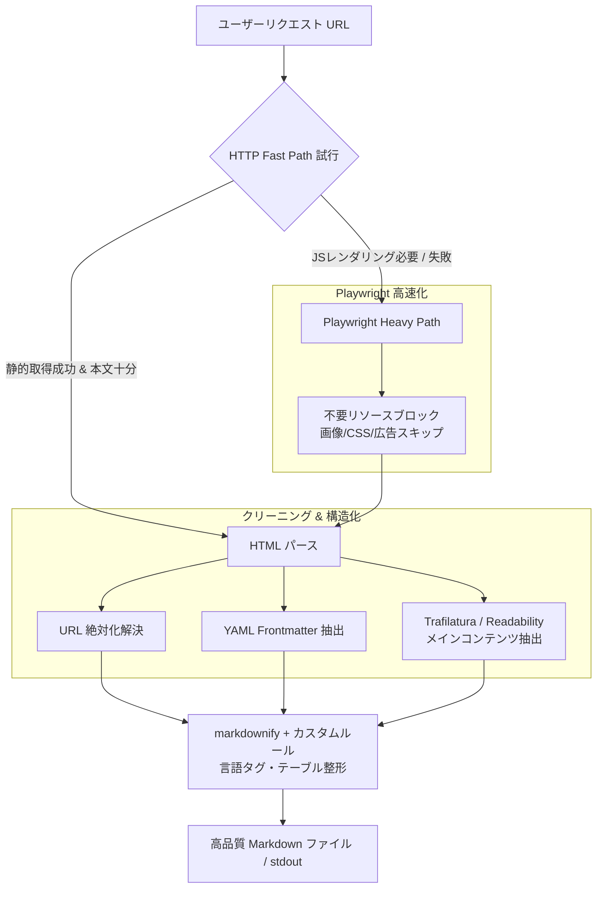

# `get-md` 改善アイデアレポート：高速化と高精度なMarkdown変換に向けた提案

`get-md` は、Playwright を用いて JavaScript レンダリング後の DOM を取得し、`markdownify` で Markdown に変換するシンプルで強力な CLI ツールです。

本ドキュメントでは、**「より速く（Speed & Performance）」** かつ **「より意味のあるMarkdown（Meaningful & Quality Output）」** を得るための具体的かつ効果的な改善アイデアを提案します。

---

## 1. 「より速く」するための改善アイデア (Performance & Speed)

現状の `get-md` は、すべてのリクエストで重厚な Headless Chromium を起動・ナビゲーション・レスポンス待ちを行っているため、静的なページや単純なページでも数秒のオーバーヘッドが発生します。以下の施策により、処理時間を半減〜1/10以下に高速化可能です。

### 1.1 ハイブリッド・フェッチ戦略（Fast Path / Heavy Path の自動切替）
* **課題**: JS レンダリングが不要な静的サイトやブログ記事に対しても Playwright を起動しており無駄が大きい。
* **改善策**:
  1. 最初に軽量な HTTP クライアント（`httpx` や `requests`）で高速に HTML を取得する (`Fast Path`)。
  2. 取得した HTML が SPA（Single Page Application）の空シェルである場合や、特定要素が不足している場合のみ、フォールバックとして Playwright を起動する (`Heavy Path`)。
  3. CLI に `--force-playwright` フラグを設けて明示的切り替えも可能にする。
* **期待効果**: 静的ページにおいて処理速度が **300ms〜500ms 程度（最大 90% 短縮）** に改善。

### 1.2 不要リソースのダウンロード・ブロック (Route Filtering)
* **課題**: ページのロード時に画像、CSS、フォント、メディア、サードパーティの追跡タグ・広告スクリプトなどが全て読み込まれており、通信量と描画時間を圧迫している。
* **改善策**:
  - スクリーンショット (`--screenshot`) オプションが指定されていない場合、Playwright の `page.route()` を使用して不要なネットワークリクエストを判定・拒否（abort）する。
  ```python
  # 例: リソースブロックの実装例
  EXCLUDED_RESOURCE_TYPES = {"image", "stylesheet", "font", "media"}

  def block_unnecessary_resources(route, request):
      if request.resource_type in EXCLUDED_RESOURCE_TYPES:
          route.abort()
      else:
          route.continue_()

  page.route("**/*", block_unnecessary_resources)
  ```
* **期待効果**: 通信データ量の削減、ページロードおよび `load` イベント発生までの時間を **50% 以上削減**。

### 1.3 `wait_until` 戦略の最適化
* **課題**: デフォルトの `page.goto()` は全リソースの読み込み完了（`load` イベント）まで待つため、重いサードパーティスクリプトがあるページで待たされる。
* **改善策**:
  - リクエスト時のイベント待ちを `domcontentloaded` や `commit` に変更可能にする。
  - 特定のメイン要素（例: `main`, `article`）が DOM に現れた時点でナビゲーション完了とみなす `page.wait_for_selector()` を活用する。

### 1.4 高速 HTML パーサーへの刷新
* **課題**: Python 標準の `html.parser` + `BeautifulSoup` によるタグ除去処理は大規模 DOM の場合にオーバーヘッドとなる。
* **改善策**:
  - `lxml` または C 言語で書かれた超高速 HTML パーサー `selectolax` (Modest engine) に変更。
* **期待効果**: HTML のパースおよび不要タグ除去が数倍〜数十倍高速化。

### 1.5 非同期 (`asyncio`) 化とブラウザインスタンスの再利用
* **課題**: 将来的に複数の URL を一括処理する場合、1リクエストごとに `sync_playwright()` を起動・終了するのは非効率。
* **改善策**:
  - `playwright.async_api` を採用し、非同期化。
  - ブラウザインスタンスを保持・再利用する設計に拡張。

---

## 2. 「より意味のある Markdown」を得るための改善アイデア (Quality & Meaningfulness)

現状の `get-md` は `body` タグ配下のすべての要素を変換するため、ヘッダー・フッター・ナビゲーション・サイドバー・広告など「本文とは関係ないノイズ情報」が大量に Markdown に含まれてしまいます。

### 2.1 メインコンテンツ抽出 (Readability / Trafilatura の導入)
* **課題**: Web ページの共通枠組み（ナビゲーション、フッター、広告、関連記事リンクなど）がそのまま Markdown になり、LLM（RAG）に投入する際などのトークン無駄遣いや誤解の原因になる。
* **改善策**:
  - 記事本文・メインコンテンツのみを自動識別・抽出するライブラリ（`trafilatura` や `readability-lxml`）をパイプラインに組み込む。
  - CLI に `--main-only`（デフォルト有効）と `--full-page` オプションを提供する。
* **出力イメージ比較**:
  - **従来**: ナビゲーションメニュー、ログインボタン、広告テキスト、著作権表示、本文…
  - **改善後**: 記事のタイトル、見出し、本文、必要なコードブロックや画像のみ。

### 2.2 相対 URL の絶対 URL 補完 (URL Resolution)
* **課題**: `<a>` タグの `href="/about"` や `` タグの `src="../images/foo.png"` がそのまま Markdown 化されると、Markdown 単体で見たときにリンク切れとなり、参照の意味をなさない。
* **改善策**:
  - 変換前に `urllib.parse.urljoin(base_url, rel_path)` を使用し、すべての相対パスリンク・画像 URL を絶対 URL に展開する。
* **例**: `[会社概要](/about)` ➔ `[会社概要](https://example.com/about)`

### 2.3 メタデータ (YAML Frontmatter) の付与
* **課題**: ページのタイトル、著者、公開日、元 URL、概要などの重要なコンテキスト情報が Markdown 構造から欠落する。
* **改善策**:
  - HTML の `<title>`, `<meta name="description">`, `<meta property="og:title">`, `<meta property="og:image">`, `<link rel="canonical">` などを自動解析し、Markdown 冒頭に YAML Frontmatter を生成して付与するオプション (`--frontmatter`) を追加。
* **出力例**:
  ```markdown
  ---
  title: "get-md の使い方"
  url: "https://example.com/docs/get-md"
  description: "WebページをMarkdownに変換するCLIツールの解説"
  fetched_at: "2026-08-30T07:21:00Z"
  ---

  # get-md の使い方
  ...
  ```

### 2.4 プログラミング言語指定コードブロックの自動判別
* **課題**: HTML 内の `<pre><code class="language-python">` が単純なバックティック3つ（`````）に変換され、シンタックスハイライト情報が失われることがある。
* **改善策**:
  - `markdownify` のカスタムコンバータを実装し、`code` タグの `class` 属性（`language-python`, `highlight-js` など）から言語名を抽出し、`` ```python `` のように言語指定付きコードブロックを出力する。

### 2.5 テーブル・数式・図の表現力向上
* **課題**: テーブルの崩れや、MathJax/KaTeX などの数式、SVG ダイアグラムが消失・崩落する。
* **改善策**:
  - MathJax/KaTeX の DOM スクリプトから TeX 文字列 (`$ ... $` や `$$ ... $$`) を再構築。
  - HTML テーブルの整形ルールを厳密化し、読みやすい GitHub Flavored Markdown (GFM) テーブルに変換。

---

## 3. アーキテクチャ構成・データフロー提案

改善後のアーキテクチャデータフローは以下のようになります。



---

## 4. 推奨実装ロードマップ

### Phase 1: 短期改善（即効性重視・依存追加少）
1. **リソースブロック機能の追加**: Playwright の `page.route` による画像・CSS遮断（`--screenshot` 未指定時）。
2. **URL 絶対化**: `bs4` パース時にリンク・画像 URL を `urljoin` で絶対パス化。
3. **YAML Frontmatter オプション**: メタタグからの情報抽出機能。

### Phase 2: 中期改善（Markdown 品質の抜本向上）
1. **`trafilatura` の統合**: 本文抽出エンジンを追加し `--main-only` モードを標準化。
2. **コードブロックの言語自動判別**: `markdownify` カスタムコンバータの拡張。

### Phase 3: 長期改善（最高速化・大規模対応）
1. **HTTP/Playwright ハイブリッド取得**: `httpx` によるプレフェッチ。
2. **`asyncio` 対応および一括バッチ処理機能**: パイプライン・複数 URL 入力のサポート。

---

以上の改善を施すことで、`get-md` は **「圧倒的に速く、LLM やナレッジベースに最適な美しい Markdown を生成するツール」** へと進化できます。
